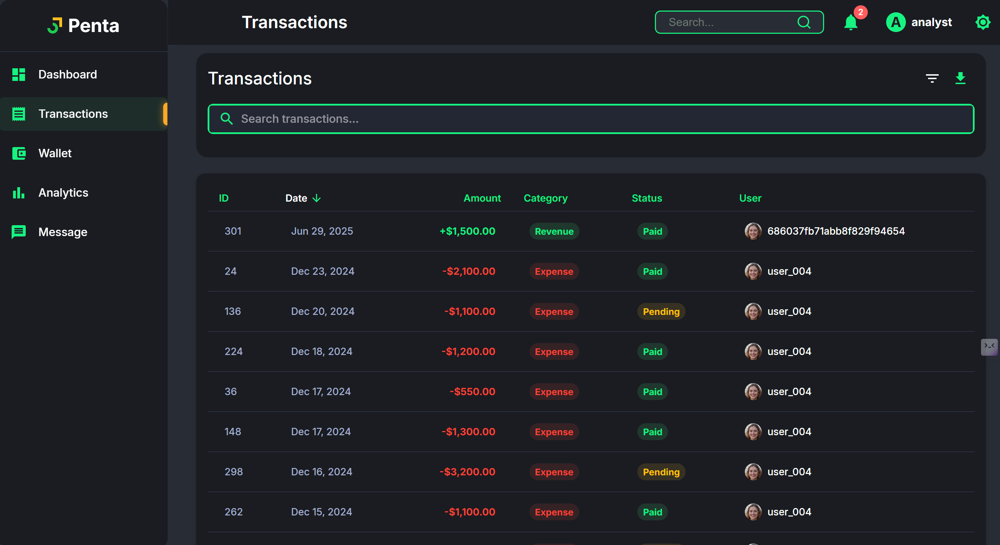
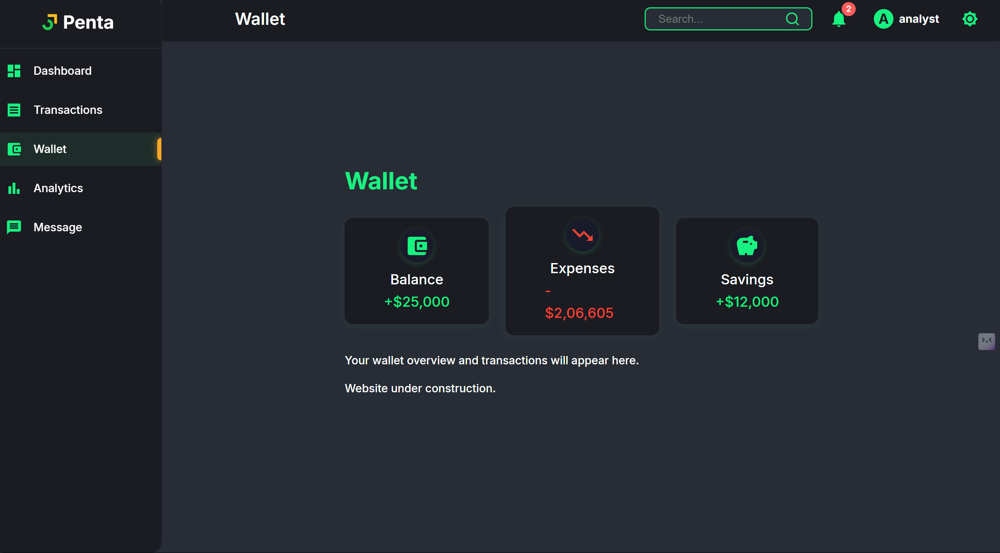
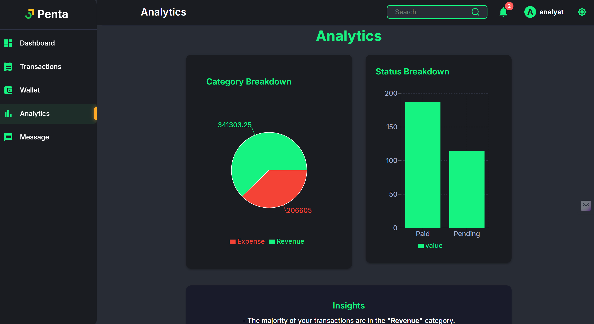
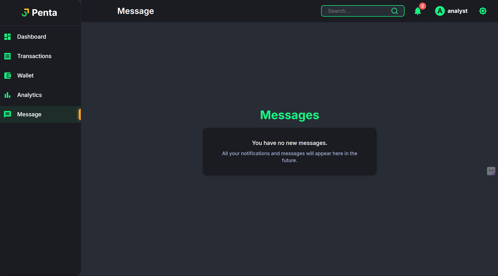
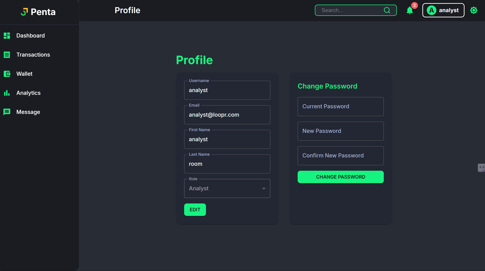
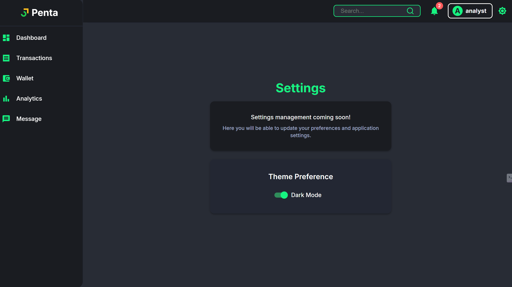

# Loopr - Personal Finance Dashboard

A modern, full-stack personal finance dashboard built with React (Vite), Material UI, Node.js/Express, and MongoDB.

---

## 🚀 Setup Instructions

### 1. Clone the repository
```bash
# Clone the repo
git clone <your-repo-url>
cd Loopr
```

### 2. Install dependencies
```bash
# Install frontend dependencies
npm install

# Install backend dependencies
cd backend
npm install
```

### 3. Configure Environment Variables
- Copy `.env.example` to `.env` in the `backend/` folder and set your MongoDB URI and JWT secret.

### 4. Seed the Database (Optional)
```bash
# From backend/
npm run dev
```

### 5. Start the Development Servers
```bash
# In project root (runs both frontend and backend)
npm run dev
```

- Frontend: https://loopr-tarunp.vercel.app/
- Backend API: https://loopr-backend.onrender.com/api

---

## 🧑‍💻 Demo Credentials

- Email: `analyst@loopr.com`
- Password: `password123`

---

## 🔄 Changing the Backend API URL

To test with a different backend (e.g., via Postman or a deployed API):
- Open `src/services/api.js` and change the `API_BASE_URL` at the top of the file:
  ```js
  const API_BASE_URL = 'https://loopr-backend.onrender.com/api'; // Change this to your backend URL
  ```
- Save and restart the frontend server.

---

## 🛠️ Usage Overview

### Login/Register
- Visit `/login` or `/register` to create an account and log in.
- Use the demo credentials above for instant access.

### Dashboard
- View analytics, charts, recent transactions, and breakdowns.

### Transactions
- Filter, search, and export transactions as CSV.

### Analytics
- See category and status breakdowns as charts.
- Insights section highlights your top categories and statuses.

### Wallet
- View your balance, expenses, and savings at a glance.

### Messages
- All notifications and messages will appear here.

---

## 📚 API Documentation

### Authentication
- `POST /api/auth/login` — Login with email and password  
  **Body:**  
  ```json
  {
    "email": "your@email.com",
    "password": "yourpassword"
  }
  ```
- `POST /api/auth/register` — Register a new user  
  **Body (all fields required):**  
  ```json
  {
    "username": "yourusername",
    "email": "your@email.com",
    "firstName": "YourFirstName",
    "lastName": "YourLastName",
    "password": "yourpassword",
    "role": "user",
    "isActive": true
  }
  ```
### Users
- `GET /api/users/profile` — Get current user profile (requires auth)
- `PUT /api/users/profile` — Update current user profile
- `PUT /api/users/change-password` — Change current user password (**requires Authorization header**)

  **Body:**  
  ```json
  {
    "currentPassword": "yourOldPassword",
    "newPassword": "yourNewPassword"
  }
  ```

  **Success Response:**  
  ```json
  {
    "success": true,
    "message": "Password changed successfully"
  }
  ```

  > **Note:**  
  > You must send your JWT token in the `Authorization` header as `Bearer <token>`.

### Transactions
- `GET /api/transactions` — List transactions (supports filters, pagination)
- `POST /api/transactions` — Create a new transaction
- `GET /api/transactions/analytics` — Get analytics (summary, breakdowns)
- `GET /api/transactions/filters` — Get filter options

### Export
- `POST /api/export/csv` — Export filtered transactions as CSV

#### Example CSV Format
```
id,date,amount,category,status,user_id,user_profile
1,2024-01-15T08:34:12Z,1500.00,Revenue,Paid,user_001,https://thispersondoesnotexist.com/
2,2024-02-21T11:14:38Z,1200.50,Expense,Paid,user_002,https://thispersondoesnotexist.com/
...etc
```
- The first row is always the header.
- All fields are comma-separated.

---

## 🧑‍💻 API URL for Postman

To test endpoints with Postman, set the base URL to your backend (e.g. `https://loopr-backend.onrender.com/api` or your deployed API).

You can change the backend URL in `src/services/api.js` as described above for local testing.

---
Screenshots:








